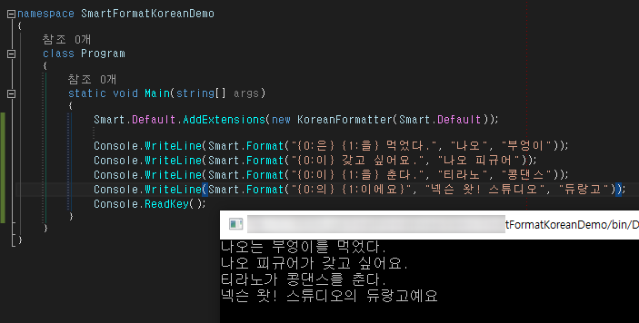

# KoreanFormatter

C#용 [SmartFormat.NET][smartformat.net]에서 사용할 수 있는 한국어 조사 포매터입니다. python용 구현체는 [smartformat-korean][smartformat-korean]을 사용해주세요.

[smartformat.net]: https://github.com/scottrippey/SmartFormat.NET
[smartformat-korean]: https://github.com/what-studio/smartformat-korean

## 설치

Nuget 관리자 콘솔을 이용해서 설치:

```cmd
PM> Install-Package SmartFormat.NET-Korean
```

혹은 [Nuget 페이지][nuget-link]에서 다운로드

[nuget-link]: https://www.nuget.org/packages/SmartFormat.NET-Korean

## 사용법

```c#
namespace SmartFormatKoreanDemo
{
	class Program
	{
		static void Main(string[] args)
		{
			Smart.Default.AddExtensions(new KoreanFormatter(Smart.Default));

			Console.WriteLine(Smart.Format("{0:는} {1:를} 먹었다.", "나오", "부엉이"));
			Console.ReadKey();
		}
	}
}
```



## 자연스러운 조사 선택

`의`, `도`, `만`, `보다`, `부터`, `까지`, `마저`, `조차`, `에~`,
`께~`, `하~`에는 어떤 단어가 앞서도 형태가 변하지 않습니다:

> 나오**의**, 모리안**의**, 키홀**의**, 나오**도**, 모리안**도**, 키홀**도**

반면 `은(는)`, `이(가)`, `을(를)`, `과(와)`는 앞선 단어의 마지막 음절의 받침
유무에 따라 형태가 달라집니다:

> 나오**는**, 모리안**은**, 키홀**은**

`(으)로~`도 비슷한 규칙을 따르지만 앞선 받침이 `ㄹ`일 경우엔 받침이 없는 것과
같게 취급합니다:

> 나오**로**, 모리안**으로**, 키홀**로**

서술격 조사 `(이)다`는 어미가 활용되어 다양한 형태로 변형될 수 있습니다:

> 나오**지만**, 모리안**이지만**, 키홀**이에요**, 나오**예요**

SmartFormat 한국어 확장은 자동으로 가장 자연스러운 조사 형태를 선택합니다.
만약 어떤 형태가 자연스러운지 알 수 없을 때에는 `은(는)`, `(으)로`처럼
모든 형태를 병기합니다.

```c#
// "대한민국은 민주공화국이다."
Smart.Format("{0:는} {1:다}.", "대한민국", "민주공화국");

// "나오는 검은사신으로 불린다.
Smart.Format("{0:은} {1:로} 불린다.", "나오", "검은사신");
```

## 만든이와 사용권

[넥슨][nexon] [왓 스튜디오][what-studio]의 [김찬웅][kexplo]과
[이흥섭][sublee]이 만들었고 [제3조항을 포함하는 BSD 허가서][bsd-3-clause]를
채택했습니다.

[nexon]: http://nexon.com/
[what-studio]: https://github.com/what-studio
[sublee]: http://subl.ee/
[kexplo]: http://chanwoong.kim/
[bsd-3-clause]: http://opensource.org/licenses/BSD-3-Clause
